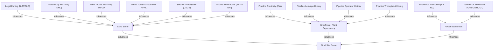

# Land Module Handoff Guide: Site Score Data Engineering

This document serves as the formal technical handoff for the "Land Module" of the Collide AI-for-Energy pipeline. It provides the grounding data for calculating the **Final Site Score** via three main pillars: Land Score, Grid/Power Dependency, and Power Economics.

## Site Scoring Architecture

The following workflow illustrates how the datasets provided in this handoff influence the various scoring tiers.

## Land Score Components (Input Tiers)

These files provide the spatial and environmental context for the `Land Score [B]`.

### 1. Seismic Zone/Score (`usgs_seismic`)
**Source**: USGS FDSN Earthquake Catalog  
**Criteria**: Magnitude > 2.5, Period 2010–2026, SW/ERCOT Bounding Box.  
**Rows**: 16,722  

| Field | Meaning | Plain English |
| :--- | :--- | :--- |
| `timestamp_utc` | Event time in UTC | When the earthquake happened. |
| `mag` | Moment Magnitude | How strong it was (logarithmic scale). |
| `place` | Text description | Nearest city/landmark. |
| `lat`, `lon` | WGS84 Coordinates | Exact epicentral location. |
| `ids` | Event IDs | Unique audit keys (comma-separated if merged). |

> [!TIP]
> The threshold of 2.5 magnitude ensures that the distribution captures all "felt" seismic activity relevant to structural integrity without noise from micro-seismic events.

### 2. Wildfire Zone/Score (`fema_nri_wildfire`)
**Source**: FEMA National Risk Index (NRI) Census Tracts  
**Scope**: AZ, NM, TX Total Coverage.  
**Rows**: 9,260 (Census Tract Level)

| Field | Meaning | Plain English |
| :--- | :--- | :--- |
| `wildfire_risk_score` | Composite Index | FEMA's calculated risk based on hazard, exposure, and vulnerability. |
| `wildfire_risk_rating` | Qualitative Rating | "Very Low" to "Very High" risk classification. |
| `tract_fips` | 11-digit FIPS code | Standard ID for joining with Census/Demographic data. |
| `population` | Census Population | Exposure context for the risk area. |

### 3. Legal/Zoning (`blm_sma` / `glo_leases`)
**Source**: BLM National Surface Management Agency & Texas GLO.  
**Purpose**: Determine if land is available for development or restricted by federal/state leases.

*   `blm_sma`: 8,000+ parcels across SW detailing federal ownership/administration.
*   `glo_oilgas_active`: 7,300+ active oil/gas leases in Texas to identify potential mineral right conflicts.

### 4. Water & Flood Proximity (`nhd_waterbody` / `fema_floodplain`)
**Source**: USGS NHD (Hydrography) and FEMA NFHL (Flood Hazard).  
**Purpose**: Cooling water access and flood risk mitigation.

*   `nhd_waterbody`: 59,000+ features identifying lakes and reservoirs for proximity calculations.
*   `fema_floodplain`: 100-year and 500-year flood zone polygons for the entire Southwest region.

## Grid & Power Plant Dependency (`pipelines_infra`)
**Source**: EIA Natural Gas Infrastructure  
**Rows**: 15,958 segments  

This file supports **Pillar [C]** by providing distance-to-nearest-pipeline context.
*   **Fields**: `pipe_type`, `operator`, `status`, `geometry_wkt`.
*   **Gap Note**: Pipeline leakage and throughput history remain high-priority gaps for future integration once PHMSA datasets are reachable.

## Power Economics (`eia_ng`, `caiso_lmp`, `ercot_DAM_prices`)
**Source**: EIA Energy Portal, CAISO OASIS, ERCOT DAM.  
**Purpose**: Support **Pillar [D]** time-series fuel and grid price predictions.

*   `eia_ng_henry_hub`: Daily spot prices (Henry Hub) for regional fuel baseline.
*   `caiso_lmp` / `ercot_DAM_prices`: High-resolution market history for grid price volatility modeling.

---
## Storage Locations

All Land Module data is persisted in two locations for team access:

### 1. Training Distribution Snapshot (CSV/Parquet)
Used for one-off training runs and external distribution.
*   **Path**: `data/training/distribution_handoff_20260419T100610Z/`
*   **Seismic**: `usgs_seismic.csv` (16,722 rows)
*   **Wildfire**: Segmented into 5 parts (`fema_nri_wildfire_part1.csv` to `part5.csv`) to satisfy GitHub file size limits. Total 9,260 Census Tracts.

### 2. Production Silver Layer (Normalized Parquet)
The persistent, validated, and deduplicated source of truth for siter models.
*   **Seismic Root**: `data/silver/usgs_seismic/`
*   **Wildfire Root**: `data/silver/fema_nri_wildfire/`

**Manifest Verification**:  
All data generated for this handoff is logged in the `manifest.json` within the training snapshot folder for integrity checking.
