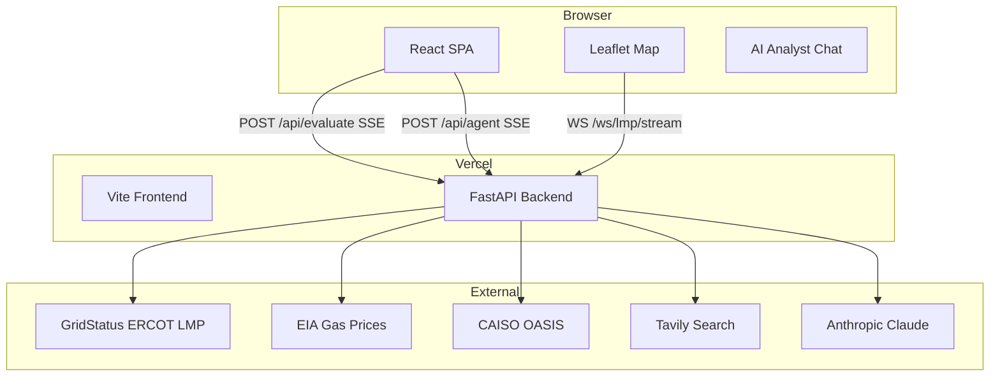
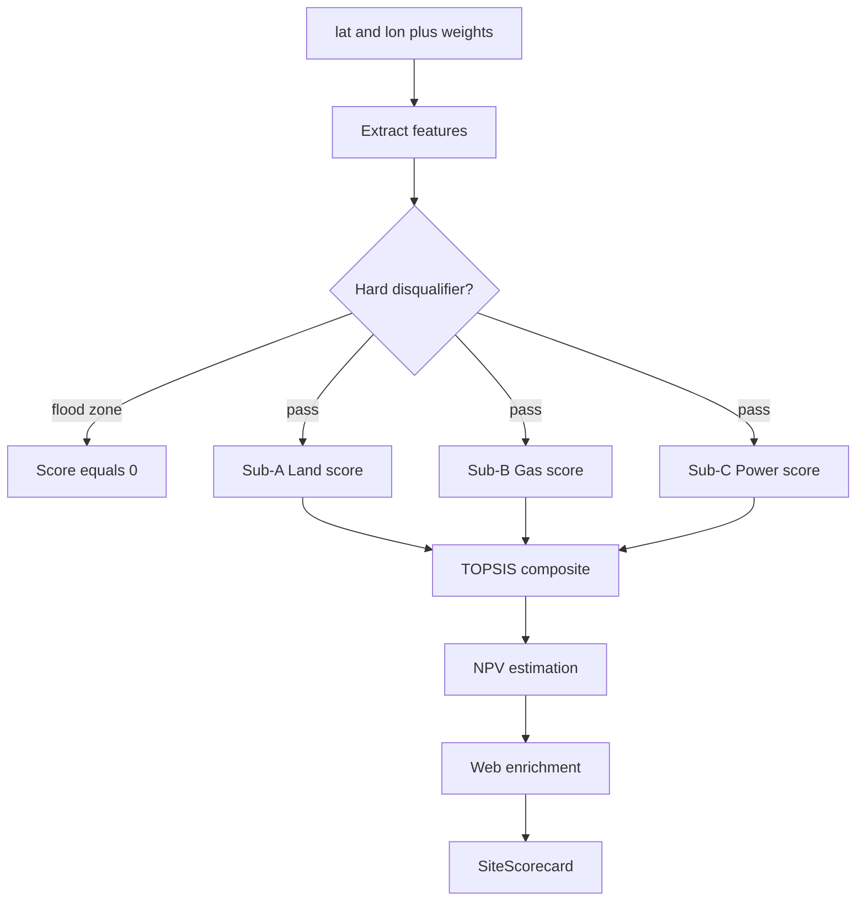
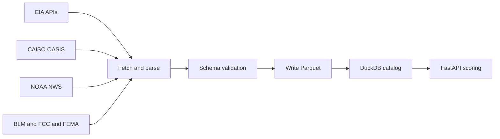

# Docs Pages Implementation Plan

> **For agentic workers:** REQUIRED SUB-SKILL: Use superpowers:subagent-driven-development (recommended) or superpowers:executing-plans to implement this plan task-by-task. Steps use checkbox (`- [ ]`) syntax for tracking.

**Goal:** Add six `/docs/:page` documentation pages to the COLLIDE platform, rendered from Markdown via `marked` + `mermaid`, behind a shared Navbar and an in-page sidebar.

**Architecture:** React Router DOM v6 wraps the existing app at root. `/docs/:page` maps to `DocsPage` which picks the right `.md` file (imported as raw string via Vite's `?raw` loader) and passes it to `DocsContent` for rendering. The existing `App` at `/` is completely untouched.

**Tech Stack:** react-router-dom v6, marked (markdown → HTML), mermaid v10+ (diagrams), Vitest + React Testing Library (existing test stack)

---

## File map

| Action | Path | Responsibility |
|---|---|---|
| Create | `src/docs/pages/overview.md` | Overview page markdown |
| Create | `src/docs/pages/architecture.md` | Architecture page markdown |
| Create | `src/docs/pages/howitworks.md` | Scoring engine markdown |
| Create | `src/docs/pages/features.md` | Features guide markdown |
| Create | `src/docs/pages/data.md` | Data pipeline markdown |
| Create | `src/docs/pages/schema.md` | Schema reference markdown |
| Create | `src/docs/pages/index.js` | Imports all `.md` files, exports `DOCS_PAGES` map + `DOCS_NAV` list |
| Create | `src/docs/docs.css` | Scoped prose + layout styles for docs pages |
| Create | `src/docs/DocsSidebar.jsx` | Left nav — 6 NavLink items, active highlight |
| Create | `src/docs/DocsContent.jsx` | Renders markdown via `marked`, calls `mermaid.run()` on mount |
| Create | `src/docs/DocsLayout.jsx` | Flex wrapper: sidebar left + content right |
| Create | `src/docs/DocsPage.jsx` | Route component: reads `:page` param, renders layout |
| Create | `src/docs/__tests__/DocsSidebar.test.jsx` | Sidebar unit tests |
| Create | `src/docs/__tests__/DocsContent.test.jsx` | Content renderer tests |
| Create | `src/docs/__tests__/DocsPage.test.jsx` | Route integration tests |
| Modify | `src/main.jsx` | Add BrowserRouter + Routes |
| Modify | `src/components/Navbar.jsx` | Add Docs link; add default props |
| Modify | `src/components/Footer.jsx` | Wire "Schema Reference" → `/docs/schema` |
| Modify | `vercel.json` | Add SPA fallback rewrite |

---

### Task 1: Install packages and add SPA fallback

**Files:**
- Modify: `package.json` (via npm)
- Modify: `vercel.json`

- [ ] **Step 1: Install dependencies**

```bash
npm install react-router-dom marked mermaid
```

Expected output: 3 packages added, no peer dep warnings.

- [ ] **Step 2: Add SPA fallback to vercel.json**

Open `vercel.json`. The current `rewrites` array has one entry. Add a second entry **after** the API rewrite so the frontend SPA handles all non-API routes:

```json
{
  "$schema": "https://openapi.vercel.sh/vercel.json",
  "experimentalServices": {
    "frontend": {
      "routePrefix": "/",
      "framework": "vite",
      "excludeFiles": [
        "backend/**",
        "ingestion/**",
        "tests/**",
        "scripts/**",
        "docs/**",
        "data/**",
        ".venv/**",
        "dist/**"
      ]
    },
    "backend": {
      "entrypoint": "backend/main.py",
      "routePrefix": "/_/backend",
      "framework": "fastapi",
      "excludeFiles": [
        "src/**",
        "ingestion/**",
        "tests/**",
        "scripts/**",
        "docs/**",
        "node_modules/**",
        ".venv/**",
        "dist/**"
      ]
    }
  },
  "rewrites": [
    {
      "source": "/api/:path*",
      "destination": "/_/backend/api/:path*"
    },
    {
      "source": "/(.*)",
      "destination": "/index.html"
    }
  ]
}
```

- [ ] **Step 3: Commit**

```bash
git add vercel.json package.json package-lock.json
git commit -m "feat: install react-router-dom, marked, mermaid; add SPA fallback"
```

---

### Task 2: Update main.jsx with BrowserRouter and Routes

**Files:**
- Modify: `src/main.jsx`

- [ ] **Step 1: Rewrite main.jsx**

```jsx
import React from 'react'
import ReactDOM from 'react-dom/client'
import { BrowserRouter, Routes, Route, Navigate } from 'react-router-dom'
import App from './App.jsx'
import DocsPage from './docs/DocsPage.jsx'
import './index.css'
import 'leaflet/dist/leaflet.css'

ReactDOM.createRoot(document.getElementById('root')).render(
  <React.StrictMode>
    <BrowserRouter>
      <Routes>
        <Route path="/docs" element={<Navigate to="/docs/overview" replace />} />
        <Route path="/docs/:page" element={<DocsPage />} />
        <Route path="/*" element={<App />} />
      </Routes>
    </BrowserRouter>
  </React.StrictMode>,
)
```

- [ ] **Step 2: Verify dev server still starts**

```bash
npm run dev
```

Expected: Vite starts on port 5173 (or next available), no console errors on `http://localhost:5173`.

- [ ] **Step 3: Commit**

```bash
git add src/main.jsx
git commit -m "feat: add BrowserRouter with /docs/:page route"
```

---

### Task 3: Create the docs CSS

**Files:**
- Create: `src/docs/docs.css`

- [ ] **Step 1: Create the file**

```css
/* ─── Docs layout ────────────────────────────────────────── */
.docs-page {
  min-height: 100vh;
  padding-top: 64px;
  background: var(--dark);
  display: flex;
}

.docs-layout {
  display: flex;
  width: 100%;
  max-width: 1200px;
  margin: 0 auto;
  padding: 0 24px;
  gap: 48px;
}

/* ─── Sidebar ────────────────────────────────────────────── */
.docs-sidebar {
  width: 180px;
  flex-shrink: 0;
  padding-top: 40px;
}

.docs-sidebar-title {
  font-family: var(--mono);
  font-size: 10px;
  font-weight: 600;
  letter-spacing: 0.18em;
  text-transform: uppercase;
  color: var(--text-muted);
  margin-bottom: 16px;
  padding-left: 12px;
}

.docs-nav {
  list-style: none;
  display: flex;
  flex-direction: column;
  gap: 2px;
}

.docs-nav-link {
  display: block;
  padding: 8px 12px;
  border-radius: 6px;
  font-family: var(--mono);
  font-size: 12px;
  font-weight: 500;
  letter-spacing: 0.04em;
  color: var(--text-muted);
  text-decoration: none;
  border-left: 2px solid transparent;
  transition: color 0.15s, background 0.15s, border-color 0.15s;
}

.docs-nav-link:hover {
  color: var(--text-dark);
  background: rgba(255, 255, 255, 0.04);
}

.docs-nav-link--active {
  color: var(--orange-light);
  border-left-color: var(--orange-light);
  background: var(--orange-glow);
}

/* ─── Content area ───────────────────────────────────────── */
.docs-content-wrap {
  flex: 1;
  min-width: 0;
  padding: 40px 0 80px;
}

.docs-content {
  max-width: 760px;
  font-family: var(--sans);
  font-size: 15px;
  line-height: 1.75;
  color: var(--text-dark);
}

.docs-content h1 {
  font-size: 32px;
  font-weight: 800;
  letter-spacing: -0.03em;
  color: var(--text-dark);
  margin: 0 0 8px;
  line-height: 1.2;
}

.docs-content h2 {
  font-size: 20px;
  font-weight: 700;
  color: var(--text-dark);
  margin: 48px 0 16px;
  padding-bottom: 8px;
  border-bottom: 1px solid var(--dark-border);
}

.docs-content h3 {
  font-size: 16px;
  font-weight: 600;
  color: var(--text-dark);
  margin: 32px 0 12px;
}

.docs-content p {
  margin: 0 0 16px;
  color: rgba(244, 239, 228, 0.82);
}

.docs-content ul,
.docs-content ol {
  margin: 0 0 16px;
  padding-left: 24px;
  color: rgba(244, 239, 228, 0.82);
}

.docs-content li {
  margin-bottom: 6px;
}

.docs-content li + li {
  margin-top: 4px;
}

.docs-content strong {
  font-weight: 600;
  color: var(--text-dark);
}

.docs-content a {
  color: var(--teal-light);
  text-decoration: none;
}

.docs-content a:hover {
  text-decoration: underline;
}

.docs-content blockquote {
  border-left: 3px solid var(--dark-border);
  margin: 0 0 16px;
  padding: 4px 0 4px 16px;
  font-style: italic;
  color: var(--text-muted);
}

.docs-content hr {
  border: none;
  border-top: 1px solid var(--dark-border);
  margin: 40px 0;
}

/* ─── Code ───────────────────────────────────────────────── */
.docs-content code {
  font-family: var(--mono);
  font-size: 13px;
  background: rgba(255, 255, 255, 0.07);
  padding: 2px 6px;
  border-radius: 4px;
  color: var(--parchment-2);
}

.docs-content pre {
  background: var(--dark-card);
  border: 1px solid var(--dark-border);
  border-radius: 8px;
  padding: 16px 20px;
  overflow-x: auto;
  margin: 0 0 20px;
}

.docs-content pre code {
  background: none;
  padding: 0;
  font-size: 13px;
  color: rgba(244, 239, 228, 0.78);
  white-space: pre;
}

/* ─── Tables ─────────────────────────────────────────────── */
.docs-content table {
  width: 100%;
  border-collapse: collapse;
  margin: 0 0 24px;
  font-size: 14px;
}

.docs-content th {
  text-align: left;
  padding: 8px 16px;
  background: rgba(255, 255, 255, 0.04);
  border-bottom: 1px solid var(--dark-border);
  font-family: var(--mono);
  font-size: 11px;
  font-weight: 600;
  letter-spacing: 0.08em;
  text-transform: uppercase;
  color: var(--text-muted);
}

.docs-content td {
  padding: 10px 16px;
  border-bottom: 1px solid rgba(42, 35, 24, 0.6);
  color: rgba(244, 239, 228, 0.82);
  vertical-align: top;
}

.docs-content tr:last-child td {
  border-bottom: none;
}

/* ─── Mermaid diagrams ───────────────────────────────────── */
.docs-content .mermaid {
  background: var(--dark-card);
  border: 1px solid var(--dark-border);
  border-radius: 8px;
  padding: 24px;
  margin: 0 0 24px;
  overflow-x: auto;
  text-align: center;
}

.docs-content .mermaid svg {
  max-width: 100%;
}

/* ─── 404 state ──────────────────────────────────────────── */
.docs-not-found {
  padding: 40px 0;
  color: var(--text-muted);
  font-family: var(--mono);
  font-size: 14px;
}

/* ─── Mobile ─────────────────────────────────────────────── */
@media (max-width: 720px) {
  .docs-layout {
    flex-direction: column;
    gap: 0;
  }

  .docs-sidebar {
    width: 100%;
    padding-top: 24px;
    border-bottom: 1px solid var(--dark-border);
    padding-bottom: 16px;
    margin-bottom: 8px;
  }

  .docs-nav {
    flex-direction: row;
    flex-wrap: wrap;
    gap: 4px;
  }

  .docs-nav-link {
    border-left: none;
    border-bottom: 2px solid transparent;
    padding: 6px 10px;
  }

  .docs-nav-link--active {
    border-bottom-color: var(--orange-light);
    background: var(--orange-glow);
  }
}
```

- [ ] **Step 2: Commit**

```bash
git add src/docs/docs.css
git commit -m "feat: add docs layout and prose CSS"
```

---

### Task 4: Create pages/index.js with stub content

**Files:**
- Create: `src/docs/pages/index.js`

This file will later be updated to import `.md` files. For now it exports inline stubs so components can be built and tested immediately.

- [ ] **Step 1: Create src/docs/pages/index.js**

```js
// Stub content — replaced with ?raw .md imports in Task 9
const stubs = {
  overview:     '# What is COLLIDE?\n\nStub — full content coming in Task 9.',
  architecture: '# System Architecture\n\nStub.',
  howitworks:   '# How the Scoring Works\n\nStub.',
  features:     '# Platform Features\n\nStub.',
  data:         '# Data Sources & Pipeline\n\nStub.',
  schema:       '# Schema Reference\n\nStub.',
}

export const DOCS_NAV = [
  { key: 'overview',     label: 'Overview' },
  { key: 'architecture', label: 'Architecture' },
  { key: 'howitworks',   label: 'How It Works' },
  { key: 'features',     label: 'Features' },
  { key: 'data',         label: 'Data' },
  { key: 'schema',       label: 'Schema' },
]

export const DOCS_PAGES = {
  overview:     { title: 'What is COLLIDE?',       content: stubs.overview },
  architecture: { title: 'System Architecture',    content: stubs.architecture },
  howitworks:   { title: 'How the Scoring Works',  content: stubs.howitworks },
  features:     { title: 'Platform Features',      content: stubs.features },
  data:         { title: 'Data Sources & Pipeline', content: stubs.data },
  schema:       { title: 'Schema Reference',       content: stubs.schema },
}
```

- [ ] **Step 2: Commit**

```bash
git add src/docs/pages/index.js
git commit -m "feat: add docs pages index with nav config and stub content"
```

---

### Task 5: Create DocsSidebar with tests

**Files:**
- Create: `src/docs/DocsSidebar.jsx`
- Create: `src/docs/__tests__/DocsSidebar.test.jsx`

- [ ] **Step 1: Write the failing test**

Create `src/docs/__tests__/DocsSidebar.test.jsx`:

```jsx
import { describe, it, expect } from 'vitest'
import { render, screen } from '@testing-library/react'
import { MemoryRouter, Routes, Route } from 'react-router-dom'
import DocsSidebar from '../DocsSidebar'

function renderSidebar(page = 'overview') {
  return render(
    <MemoryRouter initialEntries={[`/docs/${page}`]}>
      <Routes>
        <Route path="/docs/:page" element={<DocsSidebar />} />
      </Routes>
    </MemoryRouter>
  )
}

describe('DocsSidebar', () => {
  it('renders all 6 navigation items', () => {
    renderSidebar()
    expect(screen.getByText('Overview')).toBeInTheDocument()
    expect(screen.getByText('Architecture')).toBeInTheDocument()
    expect(screen.getByText('How It Works')).toBeInTheDocument()
    expect(screen.getByText('Features')).toBeInTheDocument()
    expect(screen.getByText('Data')).toBeInTheDocument()
    expect(screen.getByText('Schema')).toBeInTheDocument()
  })

  it('marks the active page link', () => {
    renderSidebar('architecture')
    const activeLink = screen.getByText('Architecture').closest('a')
    expect(activeLink).toHaveClass('docs-nav-link--active')
  })

  it('does not mark inactive links as active', () => {
    renderSidebar('architecture')
    const overviewLink = screen.getByText('Overview').closest('a')
    expect(overviewLink).not.toHaveClass('docs-nav-link--active')
  })
})
```

- [ ] **Step 2: Run test — verify it fails**

```bash
npm test -- DocsSidebar
```

Expected: FAIL — `DocsSidebar` module not found.

- [ ] **Step 3: Create DocsSidebar.jsx**

```jsx
import { NavLink } from 'react-router-dom'
import { DOCS_NAV } from './pages/index.js'

export default function DocsSidebar() {
  return (
    <aside className="docs-sidebar">
      <div className="docs-sidebar-title">Documentation</div>
      <ul className="docs-nav">
        {DOCS_NAV.map(({ key, label }) => (
          <li key={key}>
            <NavLink
              to={`/docs/${key}`}
              className={({ isActive }) =>
                isActive ? 'docs-nav-link docs-nav-link--active' : 'docs-nav-link'
              }
            >
              {label}
            </NavLink>
          </li>
        ))}
      </ul>
    </aside>
  )
}
```

- [ ] **Step 4: Run test — verify it passes**

```bash
npm test -- DocsSidebar
```

Expected: PASS — 3 tests pass.

- [ ] **Step 5: Commit**

```bash
git add src/docs/DocsSidebar.jsx src/docs/__tests__/DocsSidebar.test.jsx
git commit -m "feat: add DocsSidebar component with nav tests"
```

---

### Task 6: Create DocsContent with tests

**Files:**
- Create: `src/docs/DocsContent.jsx`
- Create: `src/docs/__tests__/DocsContent.test.jsx`

- [ ] **Step 1: Write the failing test**

Create `src/docs/__tests__/DocsContent.test.jsx`:

```jsx
import { describe, it, expect, vi } from 'vitest'
import { render } from '@testing-library/react'
import DocsContent from '../DocsContent'

vi.mock('mermaid', () => ({
  default: {
    initialize: vi.fn(),
    run: vi.fn().mockResolvedValue(undefined),
  },
}))

describe('DocsContent', () => {
  it('renders markdown headings as HTML', () => {
    const { container } = render(<DocsContent markdown="# Hello World" />)
    expect(container.querySelector('h1').textContent).toBe('Hello World')
  })

  it('renders markdown paragraphs', () => {
    const { container } = render(<DocsContent markdown="Just a paragraph." />)
    expect(container.querySelector('p').textContent).toBe('Just a paragraph.')
  })

  it('renders GFM tables', () => {
    const md = '| A | B |\n|---|---|\n| 1 | 2 |'
    const { container } = render(<DocsContent markdown={md} />)
    expect(container.querySelector('table')).not.toBeNull()
    expect(container.querySelector('th').textContent).toBe('A')
  })

  it('renders mermaid code blocks as .mermaid elements', () => {
    const md = '```mermaid\ngraph TD\n  A --> B\n```'
    const { container } = render(<DocsContent markdown={md} />)
    expect(container.querySelector('.mermaid')).not.toBeNull()
  })

  it('renders empty string without crashing', () => {
    const { container } = render(<DocsContent markdown="" />)
    expect(container.querySelector('.docs-content')).not.toBeNull()
  })
})
```

- [ ] **Step 2: Run test — verify it fails**

```bash
npm test -- DocsContent
```

Expected: FAIL — `DocsContent` module not found.

- [ ] **Step 3: Create DocsContent.jsx**

```jsx
import { marked } from 'marked'
import mermaid from 'mermaid'
import { useEffect, useRef } from 'react'

// Configure marked once at module level
marked.use({
  renderer: {
    code({ text, lang }) {
      if (lang === 'mermaid') return `<pre class="mermaid">${text}</pre>`
      return false
    },
  },
})

mermaid.initialize({ startOnLoad: false, theme: 'dark', securityLevel: 'loose' })

export default function DocsContent({ markdown }) {
  const ref = useRef(null)
  const html = marked.parse(markdown || '')

  useEffect(() => {
    if (!ref.current) return
    const nodes = Array.from(ref.current.querySelectorAll('.mermaid'))
    if (nodes.length === 0) return
    mermaid.run({ nodes }).catch(() => {})
  }, [html])

  return (
    <div
      ref={ref}
      className="docs-content"
      dangerouslySetInnerHTML={{ __html: html }}
    />
  )
}
```

- [ ] **Step 4: Run test — verify it passes**

```bash
npm test -- DocsContent
```

Expected: PASS — 5 tests pass.

- [ ] **Step 5: Commit**

```bash
git add src/docs/DocsContent.jsx src/docs/__tests__/DocsContent.test.jsx
git commit -m "feat: add DocsContent component with marked+mermaid rendering"
```

---

### Task 7: Create DocsLayout, DocsPage and tests

**Files:**
- Create: `src/docs/DocsLayout.jsx`
- Create: `src/docs/DocsPage.jsx`
- Create: `src/docs/__tests__/DocsPage.test.jsx`

- [ ] **Step 1: Write the failing test**

Create `src/docs/__tests__/DocsPage.test.jsx`:

```jsx
import { describe, it, expect, vi } from 'vitest'
import { render, screen } from '@testing-library/react'
import { MemoryRouter, Routes, Route } from 'react-router-dom'
import DocsPage from '../DocsPage'

vi.mock('mermaid', () => ({
  default: {
    initialize: vi.fn(),
    run: vi.fn().mockResolvedValue(undefined),
  },
}))

// Navbar uses useLocation — must be inside a Router
vi.mock('../../components/Navbar', () => ({
  default: () => <nav data-testid="navbar" />,
}))

function renderPage(page) {
  return render(
    <MemoryRouter initialEntries={[`/docs/${page}`]}>
      <Routes>
        <Route path="/docs/:page" element={<DocsPage />} />
      </Routes>
    </MemoryRouter>
  )
}

describe('DocsPage', () => {
  it('renders the navbar', () => {
    renderPage('overview')
    expect(screen.getByTestId('navbar')).toBeInTheDocument()
  })

  it('renders overview page content', () => {
    renderPage('overview')
    expect(screen.getByText(/What is COLLIDE/i)).toBeInTheDocument()
  })

  it('shows not-found message for unknown page key', () => {
    renderPage('notapage')
    expect(screen.getByText(/not found/i)).toBeInTheDocument()
  })

  it('renders the sidebar', () => {
    renderPage('overview')
    expect(screen.getByText('Overview')).toBeInTheDocument()
    expect(screen.getByText('Schema')).toBeInTheDocument()
  })
})
```

- [ ] **Step 2: Run test — verify it fails**

```bash
npm test -- DocsPage
```

Expected: FAIL — module not found.

- [ ] **Step 3: Create DocsLayout.jsx**

```jsx
import DocsSidebar from './DocsSidebar'
import './docs.css'

export default function DocsLayout({ children }) {
  return (
    <div className="docs-page">
      <div className="docs-layout">
        <DocsSidebar />
        <div className="docs-content-wrap">
          {children}
        </div>
      </div>
    </div>
  )
}
```

- [ ] **Step 4: Create DocsPage.jsx**

```jsx
import Navbar from '../components/Navbar'
import DocsLayout from './DocsLayout'
import DocsContent from './DocsContent'
import { DOCS_PAGES } from './pages/index.js'
import { useParams } from 'react-router-dom'

export default function DocsPage() {
  const { page } = useParams()
  const doc = DOCS_PAGES[page]

  return (
    <>
      <Navbar />
      <DocsLayout>
        {doc
          ? <DocsContent markdown={doc.content} />
          : <div className="docs-not-found">Page "{page}" not found.</div>
        }
      </DocsLayout>
    </>
  )
}
```

- [ ] **Step 5: Run test — verify it passes**

```bash
npm test -- DocsPage
```

Expected: PASS — 4 tests pass.

- [ ] **Step 6: Commit**

```bash
git add src/docs/DocsLayout.jsx src/docs/DocsPage.jsx src/docs/__tests__/DocsPage.test.jsx
git commit -m "feat: add DocsLayout and DocsPage route components"
```

---

### Task 8: Write all 6 markdown content files

**Files:**
- Create: `src/docs/pages/overview.md`
- Create: `src/docs/pages/architecture.md`
- Create: `src/docs/pages/howitworks.md`
- Create: `src/docs/pages/features.md`
- Create: `src/docs/pages/data.md`
- Create: `src/docs/pages/schema.md`

- [ ] **Step 1: Create overview.md**

```markdown
# What is COLLIDE?

COLLIDE is an AI-powered platform for finding the best sites to build **behind-the-meter (BTM) natural gas data centers** in Texas and the Southwest — without waiting years for a grid interconnection.

## The problem

Hyperscale AI data centers need 50–500 MW of power running 24/7. Connecting to the grid used to be the obvious path, but interconnection queues now stretch **3 to 7 years**. The alternative is generating power on-site with natural gas. But picking a good site means evaluating three things at once:

- **Land viability** — zoning, fiber proximity, water access, lease structures
- **Gas supply reliability** — pipeline age, failure risk, curtailment history
- **Power economics** — is generating your own gas power cheaper than buying from the grid here?

Right now, developers evaluate these in silos over weeks. A site that passes the land check might fail on gas reliability. One that looks great on economics might have pipeline issues that only surface later.

## What COLLIDE does

COLLIDE scores every candidate site across all three dimensions **simultaneously**. Click any point on the map and within seconds you get:

- Land, gas, and power sub-scores (each 0–1)
- A TOPSIS-weighted composite score
- 20-year NPV estimate (P10 / P50 / P90)
- An AI-written narrative explaining the tradeoffs
- Web-enriched context from live zoning and infrastructure news

## Who it's for

- **Site selection teams** evaluating Texas and Southwest data center locations
- **Energy analysts** stress-testing BTM economics under different gas price scenarios
- **Infrastructure investors** comparing risk across a shortlist of parcels

## Quick start

1. Open the app — the live ticker at the bottom shows the current market regime
2. Click any point on the map, or right-click a predefined candidate site
3. The scorecard panel slides in from the right with the full breakdown
4. Open the AI Analyst (⚡ top-right) and ask: *"What if Waha gas spikes 40%?"*

## By the numbers

| | |
|---|---|
| Data sources | 10 public APIs |
| Scoring dimensions | 3 (land · gas · power) |
| AI agent intents | 5 (stress test · compare · timing · explain · configure) |
| LMP forecast horizon | 72 hours (P10 / P50 / P90) |
| Candidate markets | ERCOT · WECC (CAISO) |
| Background refresh | 5 min (regime), 30 min (news), 1 hr (forecast) |
```

- [ ] **Step 2: Create architecture.md**

````markdown
# System Architecture

COLLIDE has two parts: a React SPA on the frontend and a Python FastAPI backend. They communicate through REST, server-sent events (SSE), and a WebSocket for live LMP data.

## Stack

| Layer | Technology | Purpose |
|---|---|---|
| Frontend | React 18, Vite | UI, state, routing |
| Maps | Leaflet + React-Leaflet | Interactive site map |
| Charts | Recharts | Price history, forecast confidence bands |
| Backend | Python FastAPI | API, scoring engine, AI agent |
| AI orchestration | LangGraph + LangChain | Multi-step AI agent graph |
| LLM | Anthropic Claude Haiku + Sonnet | Scoring narratives, intent parsing |
| Live data | GridStatus, EIA, CAISO OASIS | Real-time LMP and gas prices |
| Web enrichment | Tavily API | Zoning and pipeline news search |
| Job scheduler | APScheduler | Background data refresh |
| Deployment | Vercel experimentalServices | Frontend + FastAPI as co-deployed services |

## System diagram



## Frontend

The frontend is a single-page React app. All state lives in custom hooks — there is no Redux or global state library. The main component is `App.jsx`, which wires the map, panels, and overlays together via a lightweight custom event bus (`window.dispatchEvent`).

**Key hooks:**

| Hook | What it does |
|---|---|
| `useEvaluate` | Streams a scorecard for a clicked coordinate via SSE |
| `useOptimize` | Runs a grid search and streams top-N candidates |
| `useAgent` | AI Analyst chat — streams tokens as they arrive |
| `useCompare` | Fetches comparison results for pinned sites |
| `useMarket` | Polls live gas prices and LMP every 30 s |
| `useForecast` | Fetches the 72 h P10/P50/P90 LMP forecast |
| `useLmpStream` | WebSocket subscription for live ERCOT LMP ticks |

## Backend

The backend is a FastAPI app with fully async endpoints. Scoring-heavy operations stream results back via SSE so the UI shows progress incrementally — you see the scorecard scores before the AI narrative finishes generating.

**Background jobs (APScheduler):**

| Interval | Job |
|---|---|
| Every 5 min | GridStatus LMP poll + regime reclassification + Waha gas price cache |
| Every 30 min | Tavily news fetch for AI Analyst context |
| Every 1 hr | Moirai 72 h LMP forecast regeneration |

## Streaming

Three endpoints stream incremental results via SSE:

- `POST /api/evaluate` — emits `scorecard` → `web_context` → `narrative` → `done`
- `POST /api/optimize` — emits `progress` → `result` (repeated) → `done`
- `POST /api/agent` — emits `token` (repeated) → `citations` → `done`

The WebSocket at `/ws/lmp/stream` pushes live ERCOT LMP ticks every 5 minutes. It's used by the live ticker in the bottom strip.
````

- [ ] **Step 3: Create howitworks.md**

````markdown
# How the Scoring Works

Every site gets scored across three independent dimensions — land, gas, and power — then combined into a single composite score using TOPSIS. Here's exactly how that works.

## The three dimensions

### Sub-A: Land viability

Scores how suitable the land parcel is for a BTM data center.

**Inputs:**
- Distance to dark fiber route (km)
- Distance to nearest water source (km)
- Distance to existing gas pipeline (km)
- Land cost per acre
- Parcel size (acres)
- BLM land ownership classification
- FEMA 100-year flood zone status

**Method:** A gradient-boosted ML model trained on parcel attributes. SHAP values explain which features drove the score up or down for that specific site.

**Hard disqualifier:** Sites inside a FEMA 100-year flood zone score 0 regardless of other factors.

---

### Sub-B: Gas supply reliability

Scores how reliable the gas supply infrastructure is at this location.

**Inputs:**
- Distance to nearest pipeline segment
- Pipeline material and vintage (from PHMSA records)
- Historical incident rate per mile
- Distance to interstate vs. intrastate supply points
- Network redundancy (number of independent supply paths)

**Method:** Survival analysis on PHMSA incident records to estimate failure probability per segment. A graph-based supply security model calculates curtailment propagation risk.

---

### Sub-C: Power economics

Scores whether BTM gas generation is economically viable here.

**Inputs:**
- Live Waha Hub gas price ($/MMBtu)
- Live LMP at the nearest ERCOT or CAISO settlement point ($/MWh)
- Heat rate assumption (BTU/kWh)
- O&M cost estimate

**Method:** Calculates the BTM spread — cost to generate minus the LMP. A positive spread means generating on-site is cheaper than buying from the grid. A regime classifier (scarcity / normal / oversupply) adjusts the durability score based on how stable the positive spread is likely to be.

---

## Scoring pipeline



## TOPSIS weighting

The composite score uses TOPSIS (Technique for Order of Preference by Similarity to Ideal Solution).

| Dimension | Default weight | Rationale |
|---|---|---|
| Land (Sub-A) | 30% | Least volatile — parcel attributes don't shift with market conditions |
| Gas (Sub-B) | 35% | Critical path for BTM viability — supply failure is existential |
| Power (Sub-C) | 35% | Drives the NPV; most sensitive to gas price changes |

You can adjust these weights in the Optimizer config dialog before running a grid search.

## Cost estimation

For each scored site, COLLIDE estimates a 20-year NPV using a Monte Carlo simulation (1,000 runs):

- **Capex:** BTM plant capex ($/MW), land acquisition, pipeline connection, water connection
- **Opex:** O&M cost, gas price (sampled from a distribution), LMP spread (sampled from a regime-conditional distribution)
- **Output:** P10, P50, P90 NPV in $M

The P50 NPV is shown in the scorecard. The gap between P10 and P90 is a measure of economic uncertainty.

## Web enrichment

After the main scorecard is computed, an async enrichment step runs:

1. Tavily searches for recent zoning news, pipeline incidents, and regulatory changes near the site
2. Claude Haiku reads the results and extracts a land quality adjustment (−0.10 to +0.10) and a pipeline reliability opinion
3. The adjustment is applied to the land score
4. Sources appear in the scorecard's web context section

This step adds 3–8 seconds but significantly improves accuracy for sites where public records alone don't tell the full story.
````

- [ ] **Step 4: Create features.md**

````markdown
# Platform Features

A walkthrough of every major feature in COLLIDE and how to use it.

## Interactive map

The map is the main interface. It shows all predefined candidate sites as coloured markers, with colour representing composite score (green = high, red = low).

**How to use:**
- **Left-click** any point on the map to score it immediately
- **Right-click** for a context menu: evaluate, add to compare, add to optimizer region, add context for AI Analyst
- **Scroll** to zoom in/out; drag to pan
- Toggle heat layers from the map controls (composite / gas / LMP score)

---

## Scorecard panel

After you click a site, the scorecard panel slides in from the right.

**What you see:**
- Composite score (0–1) with animated fill bar
- Sub-scores for land, gas, and power with SHAP feature explanations
- Cost breakdown: land acquisition, pipeline connection, water, BTM capex
- NPV range: P10 / P50 / P90 over 20 years
- AI-written narrative (streams in as it generates)
- Web enrichment sources (Tavily results that adjusted the score)

The panel loads in stages — scores appear first, then the web context, then the narrative — so you don't wait for the full response before seeing the numbers.

---

## Compare mode

Compare up to 5 sites side by side.

**How to use:**
1. Right-click any site on the map → **Add to compare**
2. Repeat for up to 4 more sites (each gets a coloured pin)
3. Click **Compare** in the bottom strip
4. The compare modal opens with all sites ranked by composite score

Each column shows the full scorecard for one site. Scroll horizontally to compare across multiple sites.

---

## Optimizer

Finds the best sites within a region you define — useful when you have a general area in mind but haven't picked exact coordinates.

**How to use:**
1. Click **Optimize** in the bottom strip
2. Draw a rectangle on the map to define your search area
3. In the config dialog: set max sites, scoring weights, gas price cap, power cost cap, and market filter
4. Click **Run** — the optimizer streams progress as it evaluates a grid of points

**What it returns:**
- Top-N candidates ranked by composite score, shown as pins on the map
- Click any pin to see its full scorecard

The optimizer runs a grid search at approximately 0.1° resolution across the bounding box.

---

## AI Analyst

A conversational AI interface that can answer questions about sites, run stress tests, and explain scoring decisions.

**How to open:** Click **⚡ AI Analyst** in the top-right of the navbar.

**What you can ask:**

| Intent | Example |
|---|---|
| Stress test | *"What if Waha gas prices spike 40% next quarter?"* |
| Compare | *"Compare the three sites I've pinned"* |
| Timing | *"When's the best time to start construction given current LMP trends?"* |
| Explain | *"Why is the land score so low for that site?"* |
| Configure | *"Set gas weight to 50% and re-score"* |

The analyst has access to your current scorecard, pinned sites, and any context chips you've added. Responses stream in token by token and include source citations.

**Context chips:** Right-click a map feature and choose **Add to analyst context** — a chip appears in the analyst panel. The AI references that data when answering.

---

## Live market data

The stats bar at the top of the page shows live market data, refreshed every 30 seconds:

- Waha Hub natural gas spot price ($/MMBtu) with 24 h change
- ERCOT West Hub real-time LMP ($/MWh)
- CAISO SP15 LMP ($/MWh)
- Balancing authority demand (GW) with net generation

---

## Live ticker

The strip at the bottom shows the current market regime, reclassified every 5 minutes:

| Regime | Meaning |
|---|---|
| Scarcity | LMP above generation cost — BTM economics are strong |
| Normal | Moderate spread — BTM is competitive |
| Oversupply | LMP depressed — BTM economics are weak |

The regime probability (shown next to the label) indicates how confident the classifier is.

---

## Heat layers

Toggle between three GeoJSON overlays to visualise scores spatially:

| Layer | What it shows |
|---|---|
| Composite | Overall site score across the visible area |
| Gas | Gas supply reliability score only |
| LMP | Power economics score based on current LMP |

Layers are fetched from `/api/heatmap` and rendered as a Leaflet colour gradient overlay.

---

## 72-hour LMP forecast

Open a scored site's scorecard and go to the **Economics** tab. You'll see a 72-hour LMP forecast with P10/P50/P90 confidence bands, overlaid with the BTM generation cost line.

- If the P50 forecast is above the cost line, BTM economics are projected to be positive for that window
- The shaded confidence band narrows as the model becomes more certain (typically tighter within 24 h)
- Forecasts are regenerated every hour in the background

The forecast model is called **Moirai** (after the Greek Fates). It uses ERCOT 5-minute LMP history, weather, and load forecasts as inputs.
````

- [ ] **Step 5: Create data.md**

````markdown
# Data Sources & Pipeline

COLLIDE ingests data from 10 public APIs. All data is stored as Parquet, validated against schemas, and catalogued in DuckDB.

## Data sources

| Source | Dataset | What it provides | Cadence |
|---|---|---|---|
| EIA-930 | `eia930` | BA demand, net generation, forecast by fuel type | 15 min |
| EIA Open Data | `eia_ng` | Henry Hub + Waha natural gas spot prices | Daily |
| CAISO OASIS | `caiso_lmp` | SP15, NP15, Palo Verde 5-min LMP | 5 min |
| NOAA NWS | `noaa_forecast` | Phoenix area weather forecast (temp, wind) | Hourly |
| NOAA ASOS | `noaa_obs` | KPHX station observations | Hourly |
| BLM GeoBOB | `blm_sma` | Federal land ownership for AZ, NM, TX | Static |
| FCC HIFLD | `hifld_fiber` | National dark fiber and FTTP availability | Static |
| USGS NHD | `nhd_waterbody` | Water body locations for cooling water proximity | Static |
| FEMA | `fema_floodplain` | 100-year flood zone boundaries | Periodic |
| EIA Gas | `pipelines_infra` | Gas pipeline routes across ERCOT and WECC | Periodic |

Static sources are refreshed quarterly. Periodic sources are checked for updates weekly.

## Pipeline flow



## Data quality guarantees

Every dataset in the pipeline has:

- **Schema contract** — Pandera validates column types, value ranges, and required fields. Rows that fail are quarantined and logged, not silently dropped.
- **Freshness check** — Each dataset has a max-staleness threshold. If fresh data isn't available the API falls back to the last known good values and sets a `stale: true` flag in the response.
- **Audit trail** — Every ingest run writes a record: source URL, timestamp, row count, pass/fail counts, schema hash.
- **Lineage** — The DuckDB catalog tracks which Parquet file each API response came from, so any data point can be traced back to its source.

## Background refresh schedule

The backend runs three types of recurring jobs:

| Interval | What runs |
|---|---|
| Every 5 min | GridStatus LMP poll + regime reclassification + Waha gas price cache update |
| Every 30 min | Tavily news fetch (industry headlines for AI Analyst context) |
| Every 1 hr | Moirai 72-hour LMP forecast regeneration |

## Running the pipeline manually

Trigger the full ingestion pipeline from the app:

```
POST /api/pipeline/run
```

Or click **Run Pipeline** in the Data Quality section at the bottom of the main page.

To run specific datasets only, use the ingestion module directly:

```bash
cd ingestion
python -m ingestion.run --sources eia_ng,caiso_lmp
```
````

- [ ] **Step 6: Create schema.md**

````markdown
# Schema Reference

Data models, API endpoint contracts, SSE event formats, and agent intent types.

## Site model

Predefined candidate sites are defined in `backend/data/sites.py` and mirrored in `src/data/sites.js`.

| Field | Type | Description |
|---|---|---|
| `id` | string | Unique slug (e.g. `permian-prime`) |
| `name` | string | Human-readable name (e.g. `Permian Prime`) |
| `lat` | float | Latitude |
| `lng` | float | Longitude |
| `state` | string | State abbreviation — `TX`, `NM`, or `AZ` |
| `market` | string | Wholesale market — `ERCOT` or `WECC` |
| `acres` | int | Estimated available parcel size |
| `land_cost_per_acre` | float | Land acquisition cost (USD/acre) |
| `fiber_km` | float | Distance to nearest dark fiber route (km) |
| `water_km` | float | Distance to nearest water source (km) |
| `pipeline_km` | float | Distance to nearest gas pipeline (km) |
| `gas_hub` | string | Primary gas pricing hub — `waha` or `henry_hub` |
| `lmp_node` | string | ERCOT or CAISO settlement point for LMP |

## Scorecard

`SiteScorecard` is the main output of the scoring engine (`backend/scoring/scorecard.py`).

| Field | Type | Description |
|---|---|---|
| `land_score` | float 0–1 | Sub-A: land viability |
| `gas_score` | float 0–1 | Sub-B: gas supply reliability |
| `power_score` | float 0–1 | Sub-C: BTM power economics |
| `composite_score` | float 0–1 | TOPSIS-weighted composite |
| `land_shap` | object | SHAP feature importances for land score |
| `spread_p50_mwh` | float | BTM spread at P50 ($/MWh) |
| `spread_durability` | float 0–1 | How stable a positive spread is likely to be |
| `regime` | string | Market state — `scarcity`, `normal`, or `oversupply` |
| `regime_proba` | float | Classifier confidence (0–1) |
| `cost` | CostEstimate | Full cost breakdown (see below) |
| `web_land_adjustment` | float | Tavily-derived land score adjustment (−0.10 to +0.10) |
| `web_pipeline_score` | float | Tavily-derived pipeline reliability opinion (0–1) |
| `sources` | array | Web enrichment source URLs |
| `live_gas_price` | float | Waha Hub spot price at evaluation time ($/MMBtu) |
| `live_lmp_mwh` | float | Settlement point LMP at evaluation time ($/MWh) |

## Cost estimate

`CostEstimate` is nested inside every scorecard (`backend/scoring/cost.py`).

| Field | Type | Description |
|---|---|---|
| `land_acquisition_m` | float | Land cost ($M) |
| `pipeline_connection_m` | float | Pipeline tie-in cost ($M) |
| `water_connection_m` | float | Water connection cost ($M) |
| `btm_capex_m` | float | BTM plant capital cost ($M) |
| `npv_p10_m` | float | 20-year NPV at 10th percentile ($M) |
| `npv_p50_m` | float | 20-year NPV at 50th percentile ($M) |
| `npv_p90_m` | float | 20-year NPV at 90th percentile ($M) |
| `wacc` | float | Discount rate used (e.g. `0.08`) |
| `capacity_mw` | float | Assumed BTM plant capacity (MW) |

## API endpoints

| Method | Path | Purpose |
|---|---|---|
| GET | `/api/health` | Health check |
| GET | `/api/sites` | All predefined candidate sites with cached scores |
| GET | `/api/sites/{id}` | Single site detail |
| GET | `/api/market` | Live gas prices, LMP, BA demand |
| POST | `/api/evaluate` | Score a coordinate (SSE stream) |
| POST | `/api/optimize` | Grid search within bounds (SSE stream) |
| GET | `/api/heatmap` | GeoJSON heat layer |
| GET | `/api/compare` | Compare N coordinates, return ranked |
| GET | `/api/forecast` | 72 h Moirai LMP forecast (P10/P50/P90) |
| GET | `/api/regime` | Current market regime classification |
| GET | `/api/cache/status` | Cache state and data freshness |
| POST | `/api/agent` | AI Analyst query (SSE stream) |
| GET | `/api/news` | Latest industry headlines via Tavily |
| POST | `/api/pipeline/run` | Trigger full ingestion pipeline |
| WS | `/ws/lmp/stream` | Live ERCOT LMP (5-min WebSocket) |

## Evaluate request

```json
POST /api/evaluate
{
  "lat": 31.5,
  "lon": -104.2,
  "weights": {
    "land": 0.30,
    "gas": 0.35,
    "power": 0.35
  }
}
```

## SSE event formats

### /api/evaluate

```
event: scorecard
data: {"land_score": 0.72, "gas_score": 0.81, "composite_score": 0.73, ...}

event: web_context
data: {"web_land_adjustment": 0.05, "sources": ["https://..."]}

event: narrative
data: {"text": "This site in the Permian Basin..."}

event: done
data: {}
```

### /api/optimize

```
event: progress
data: {"evaluated": 42, "total": 120, "pct": 35}

event: result
data: {"lat": 31.5, "lon": -104.2, "composite_score": 0.81, ...}

event: done
data: {"top_n": 5}
```

### /api/agent

```
event: token
data: {"text": "Based on current Waha prices..."}

event: citations
data: [{"url": "https://...", "title": "..."}]

event: done
data: {}
```

## Agent intent types

The AI Analyst classifies every query into one of five intents before routing to a tool:

| Intent | Trigger example | What happens |
|---|---|---|
| `stress_test` | *"What if gas spikes 40%?"* | Re-scores with modified gas price, shows delta vs. original |
| `compare` | *"Compare my pinned sites"* | Calls `/api/compare` on current pins, returns ranked table |
| `timing` | *"When should I build?"* | Combines LMP forecast + regime outlook into a recommendation |
| `explanation` | *"Why is land score low?"* | Reads SHAP values from the scorecard, explains in plain English |
| `config` | *"Set gas weight to 50%"* | Updates scoring weights and re-runs the last evaluation |
````

- [ ] **Step 7: Commit all .md files**

```bash
git add src/docs/pages/overview.md src/docs/pages/architecture.md src/docs/pages/howitworks.md src/docs/pages/features.md src/docs/pages/data.md src/docs/pages/schema.md
git commit -m "docs: write all 6 documentation page content files"
```

---

### Task 9: Update pages/index.js to use ?raw imports

**Files:**
- Modify: `src/docs/pages/index.js`

- [ ] **Step 1: Rewrite pages/index.js to import .md files as raw strings**

```js
import overview from './overview.md?raw'
import architecture from './architecture.md?raw'
import howitworks from './howitworks.md?raw'
import features from './features.md?raw'
import data from './data.md?raw'
import schema from './schema.md?raw'

export const DOCS_NAV = [
  { key: 'overview',     label: 'Overview' },
  { key: 'architecture', label: 'Architecture' },
  { key: 'howitworks',   label: 'How It Works' },
  { key: 'features',     label: 'Features' },
  { key: 'data',         label: 'Data' },
  { key: 'schema',       label: 'Schema' },
]

export const DOCS_PAGES = {
  overview:     { title: 'What is COLLIDE?',        content: overview },
  architecture: { title: 'System Architecture',     content: architecture },
  howitworks:   { title: 'How the Scoring Works',   content: howitworks },
  features:     { title: 'Platform Features',       content: features },
  data:         { title: 'Data Sources & Pipeline', content: data },
  schema:       { title: 'Schema Reference',        content: schema },
}
```

- [ ] **Step 2: Run the full test suite to confirm nothing broke**

```bash
npm test
```

Expected: All tests pass. The DocsPage test still passes because `overview.md` starts with `# What is COLLIDE?`, matching the `/What is COLLIDE/i` regex in the test.

- [ ] **Step 3: Commit**

```bash
git add src/docs/pages/index.js
git commit -m "feat: switch docs pages to ?raw .md imports"
```

---

### Task 10: Update Navbar and Footer

**Files:**
- Modify: `src/components/Navbar.jsx`
- Modify: `src/components/Footer.jsx`

- [ ] **Step 1: Update Navbar.jsx**

Replace the entire file:

```jsx
import { Link } from 'react-router-dom'

export default function Navbar({ onAnalystToggle = () => {}, analystOpen = false }) {
  return (
    <nav>
      <Link to="/" className="nav-logo">
        <svg viewBox="0 0 24 24" fill="none" xmlns="http://www.w3.org/2000/svg">
          <path d="M13 2L3 14h9l-1 8 10-12h-9l1-8z" fill="var(--orange-light)" stroke="var(--orange-light)" strokeWidth="1.5" strokeLinecap="round" strokeLinejoin="round"/>
        </svg>
        COLLIDE
      </Link>
      <ul className="nav-links">
        <li><a href="#scoring">Scoring</a></li>
        <li><a href="#workflow">Workflow</a></li>
        <li><a href="#quality">Quality</a></li>
        <li><Link to="/docs/overview">Docs</Link></li>
      </ul>
      <button
        className={`analyst-toggle-btn${analystOpen ? ' analyst-toggle-btn--active' : ''}`}
        onClick={onAnalystToggle}
        title="AI Analyst"
      >
        ⚡ AI Analyst
      </button>
    </nav>
  )
}
```

Changes from original:
- Import `Link` from `react-router-dom`
- Logo `<a href="#">` → `<Link to="/">`
- Add `Docs` link as a new `<li>`
- Add default values for `onAnalystToggle` and `analystOpen` so the component renders safely on docs pages (where these props are not passed)

- [ ] **Step 2: Update Footer.jsx**

In `Footer.jsx`, the `DEV_LINKS` array has placeholder `href: '#'` entries. Wire "Schema Reference" to `/docs/schema` and "API Docs" to `/docs/schema`:

```jsx
import { Link } from 'react-router-dom'

const DATA_LINKS = [
  { label: 'EIA-930 BA' },
  { label: 'CAISO OASIS' },
  { label: 'NOAA NWS' },
  { label: 'BLM · FEMA · FCC' },
]

const DEV_LINKS = [
  {
    label: 'GitHub Repo',
    href: 'https://github.com/BhavyaShah1234/EnergyHackathon',
    external: true,
  },
  { label: 'Schema Reference', to: '/docs/schema' },
  { label: 'API Docs', to: '/docs/schema' },
  { label: 'DuckDB Catalog', to: '/docs/data' },
]

const BADGES = ['ERCOT', 'WECC', 'EIA', 'CAISO', 'NOAA']

export default function Footer() {
  return (
    <footer>
      <div className="footer-inner">
        <div className="footer-top">
          <div className="footer-brand">
            <Link to="/" className="nav-logo" style={{ fontSize: '18px' }}>
              <svg viewBox="0 0 24 24" fill="none" xmlns="http://www.w3.org/2000/svg" style={{ width: '18px', height: '18px' }}>
                <path d="M13 2L3 14h9l-1 8 10-12h-9l1-8z" fill="var(--orange-light)" stroke="var(--orange-light)" strokeWidth="1.5" strokeLinecap="round" strokeLinejoin="round"/>
              </svg>
              COLLIDE
            </Link>
            <p>AI-powered BTM siting for natural gas data centers across ERCOT and WECC.</p>
          </div>

          <div>
            <div className="footer-col-title">Data</div>
            <ul className="footer-links">
              {DATA_LINKS.map(l => (
                <li key={l.label}><a href="#">{l.label}</a></li>
              ))}
            </ul>
          </div>

          <div>
            <div className="footer-col-title">Developers</div>
            <ul className="footer-links">
              {DEV_LINKS.map(l => (
                <li key={l.label}>
                  {l.external
                    ? <a href={l.href} target="_blank" rel="noopener noreferrer">{l.label}</a>
                    : <Link to={l.to}>{l.label}</Link>
                  }
                </li>
              ))}
            </ul>
          </div>
        </div>

        <div className="footer-bottom">
          <div className="footer-copy">
            © 2026 COLLIDE · Collide AI-for-Energy Hackathon · All data from authoritative public APIs
          </div>
          <div className="footer-badges">
            {BADGES.map(b => <span key={b} className="footer-badge">{b}</span>)}
          </div>
        </div>
      </div>
    </footer>
  )
}
```

- [ ] **Step 3: Run the full test suite**

```bash
npm test
```

Expected: All tests pass.

- [ ] **Step 4: Commit**

```bash
git add src/components/Navbar.jsx src/components/Footer.jsx
git commit -m "feat: add Docs link to Navbar; wire footer dev links to /docs pages"
```

---

## Self-review

**Spec coverage check:**

| Spec requirement | Covered by task |
|---|---|
| Routes: /docs/overview, architecture, howitworks, features, data, schema | Tasks 2, 4, 8 |
| /docs redirects to /docs/overview | Task 2 (Navigate) |
| react-router-dom for routing | Tasks 1, 2 |
| marked + GFM for rendering | Task 6 |
| mermaid for diagrams | Task 6 |
| Sidebar with active state | Task 5 |
| Shared Navbar with Docs link | Task 10 |
| Dark theme / CSS vars | Task 3 |
| Mobile sidebar as horizontal strip | Task 3 |
| vercel.json SPA fallback | Task 1 |
| Footer links wired | Task 10 |
| Existing MarkdownRenderer untouched | Not modified in any task |
| Existing App.jsx untouched | Not modified in any task |
| All 6 markdown pages with mermaid diagrams | Task 8 |

**Placeholder scan:** No TBDs, no "similar to task N" shortcuts, all code blocks are complete.

**Type consistency:** `DOCS_NAV` and `DOCS_PAGES` keys are consistent across index.js, DocsSidebar, and DocsPage. `NavLink` className function uses `docs-nav-link--active` — matches the CSS class in docs.css. `DocsContent` prop is `markdown` — used correctly in DocsPage.
